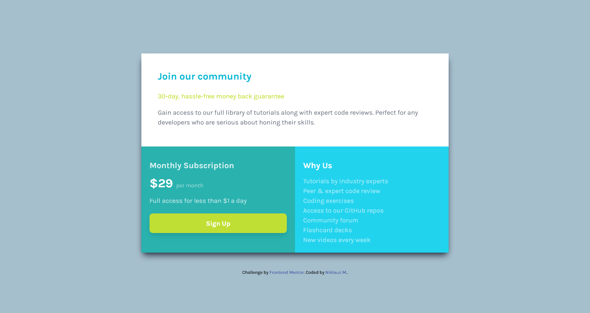

# Frontend Mentor - Single price grid component solution

This is a solution to the [Single price grid component challenge on Frontend Mentor](https://www.frontendmentor.io/challenges/single-price-grid-component-5ce41129d0ff452fec5abbbc). Frontend Mentor challenges help you improve your coding skills by building realistic projects. 

## Table of contents

- [Overview](#overview)
  - [Screenshot](#screenshot)
  - [Links](#links)
- [My process](#my-process)
  - [Built with](#built-with)
  - [What I learned](#what-i-learned)
  - [Useful resources](#useful-resources)
- [Author](#author)

## Overview

### Screenshot

### Links

- Solution URL: [Solution](https://github.com/Dhruv-mak/single-price-grid-component)
- Live Site URL: [Live Site](https://dhruv-mak.github.io/single-price-grid-component/)

## My process

### Built with

- Semantic HTML5 markup
- CSS custom properties
- Flexbox
- Mobile-first workflow

### What I learned

I'm just a beginner and this project helped me learn lot of things like:
- I learned how to use the QR Code API to generate a QR code from a string of text.
- I learned how to use CSS to style the QR code image.
- I learned how to use HTML to create a responsive layout for the QR code component.
- I learned how to use Tailwind CSS to quickly and easily style my HTML elements.
- I learned how to use the CDN to load external resources, such as fonts and JavaScript libraries.

Overall, I found this small component to be a great way to learn some basic HTML, CSS.

### Useful resources

- [Tailwind css Documentation](https://tailwindcss.com/docs/installation) - I'm just starting out and this helped me to quickly style the html elements.
- [W3schools](https://www.w3schools.com/) - This is an amazing article which helped me finally understand flexbox. I'd recommend it to anyone still learning this concept.

## Author

- Website - [Niklaus M.](https://www.your-site.com)
- Frontend Mentor - [@Dhruv-mak](https://www.frontendmentor.io/profile/Dhruv-mak)